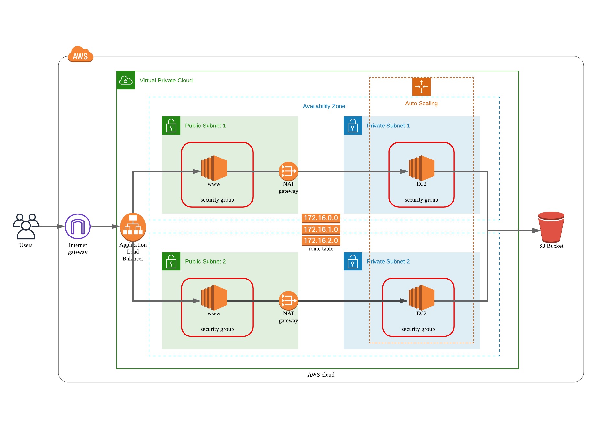

# High-Availability Application using Cloud Formation

## Objective 

This excercise is to launch servers to a very simple web app automatically using Cloud Formation script 

## Architecture Diagram

## Specs 

- A web app deployed into 4 application servers (in 2 private subnates) with Load Balancer on public subnets
- Eash machine has 
    - 2 vCPUs 
    - 4 GB RAM
    - OS: Ubuntu 18
    - 10 GB disk space
    - Downloading data from a S3 bucket is needed
    - Inbount port 80 is open to use Load Balancer and Load Balancer Health Cehck
    - Outbound port: unrestricted internet access
- Loader Balaneer allows:
    - inbound: allow all public traffic (0.0.0.0/0) on port 80 
    - outbound: only port 80 to reach the internal servers 
- Launch using Cloud Formation with a `.yml`file 

## How to Run

- To launch (create the Cloud Formation stack):
    -  `./create.sh` 
    - ` ./create_server.sh` 
- To update: 
    - `./update.sh` 
    - `./update_server.sh`

## Access URL 

- simpl-WebAp-1N967SC5Q92SE-789665295.us-east-1.elb.amazonaws.com:80  (will be terminated later)